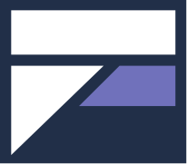

<div align="center">
  <a href="https://github.com/carere/zaidan">
    
  </a>

  <h1 style="font-size: 3rem; font-weight: 600;">Zaidan</h1>

  <p align="center">
    Beautifully designed SolidJS components based on Shadcn UI
    <br />
    <a href="https://github.com/carere/zaidan/issues/new?labels=bug&template=bug-report---.md">Report Bug</a>
    &middot;
    <a href="https://zaidan.carere.dev/docs">Documentation</a>
    &middot;
    <a href="https://zaidan.carere.dev/ui">Components</a>
  </p>
</div>

## About

Built with [Kobalte](https://kobalte.dev) & [Corvu](https://corvu.dev). Styled with [Tailwind CSS](https://tailwindcss.com). Open source.

Zaidan brings the excellent developer experience of [Shadcn UI](https://ui.shadcn.com) to [SolidJS](https://solidjs.com). It's a collection of reusable, accessible components that you can copy and paste into your projects.

## Documentation

Visit [zaidan.carere.dev](https://zaidan.carere.dev) for:

- Installation guide
- Component documentation
- Usage examples
- Theming customization

## Contributing

Contributions are welcome! Feel free to open an issue or submit a pull request on [GitHub](https://github.com/carere/zaidan).

## Development

This is a private Bun workspace with one root lockfile:

- `apps/website` owns the SolidJS website, registry, and browser fixtures. Its Moon project is `zaidan`.
- `apps/factory` owns the local factory application and its runtime dependencies.
- The root owns shared developer tools and workspace checks.

Install dependencies from the repository root with `bun install --frozen-lockfile`. The root scripts
start and build the website with the correct working directory:

```sh
bun run dev
bun run build
bun run preview
```

Run checks from the repository root through the configured direnv environment.
Build first so Velite's generated declarations are available to TypeScript:

```sh
direnv exec "$(git rev-parse --show-toplevel)" moon run zaidan:build
direnv exec "$(git rev-parse --show-toplevel)" moon run workspace:check
direnv exec "$(git rev-parse --show-toplevel)" moon run workspace:knip
direnv exec "$(git rev-parse --show-toplevel)" moon run :tsc
direnv exec "$(git rev-parse --show-toplevel)" moon run zaidan:test
direnv exec "$(git rev-parse --show-toplevel)" moon run zaidan:test-browser
```

See [browser test setup](apps/website/tests/browser/README.md) for Chromium
installation and focused regression commands. Registry validation and generation
remain available as Moon tasks `zaidan:r-validate-kobalte` and
`zaidan:r-build-kobalte`; registry source paths resolve from `apps/website`.

### Website deployment

After building, run `bun run deploy` from the repository root to publish the website
with the workspace's pinned Wrangler CLI. The build writes a root
`.wrangler/deploy/config.json` redirect to `apps/website/dist/server/wrangler.json`.
Root Wrangler commands (including Cloudflare's `wrangler versions upload` preview
command) therefore resolve the built website. The website's own `.wrangler/deploy`
redirect still supports commands run from `apps/website`; both use the same generated
configuration, derived from `apps/website/wrangler.jsonc`.
Cloudflare build settings should use the repository root for installation,
`bun run build` for the build, and `bun run deploy` for deployment.

## License

MIT License - see the [LICENSE](./LICENSE) file for details.

---

<div align="center">

Made with ❤️ for the SolidJS community

</div>
